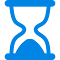

<h1 align="center">Countdown+</h1>

Windows 10 app (UWP) to create countdowns for important events and see how many years, months, weeks, days, hours, minutes and seconds remain or have already passed.
Pin countdowns to your Windows start page to see the remaining days at any time.
If enabled you will receive a notification when the countdown expires.

[Learn more](http://florianweinaug.de/countdown/)

[Download](https://www.microsoft.com/store/apps/9MT4PPQ41WXM)

## Screenshots

